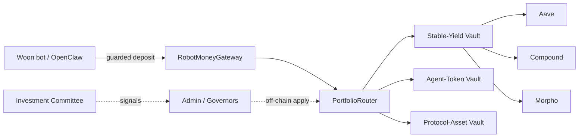

# Sprint Plan — Week of 2026-06-01

> **Audience:** Product Manager.
> **Status:** Draft for review. Fleshed out and sanity-checked against
> `docs/prd.md`, `docs/implementation-plan.md`, ADR-0001, and the live
> `robotmoney.net/committee` and `robotmoney.net/allocation` pages.
>
> Several items in the raw notes conflict with the canonical PRD/ADR or with
> what the public site currently says. Those conflicts are called out inline as
> **⚠ Flag** and collected in [§11 Open Questions & Discrepancies](#11-open-questions--discrepancies).
> Please resolve the flagged items before the corresponding workstream starts —
> they change scope.

---

## 1. Sprint Theme

Turn Robot Money from a **shipped single-protocol treasury product** into a
**governable, multi-vault platform with a public investment committee**, while
locking down the new governance attack surface and standing up genesis
allocations on Base.

The product/contract/dapp foundation (vault registry, Portfolio Router,
admin-weighted governance MVP, gateway agent withdrawal, multi-vault explorer
and dapp, demo seeding) is already complete on `dev` per the implementation
plan. This sprint layers **committee, genesis, governance RBAC, and the
user/governor UX split** on top of that foundation.

---

## 2. Sprint Goals (definition of done)

1. **Investment Committee** spec'd and a minimal version producing
   machine-readable (JSON) signals reproducible from a published chain of
   thought, with bootstrap example agents.
2. **Governance-as-signalling** principle documented and enforced: no on-chain
   path mutates live policy; admin applies changes off-chain.
3. **Genesis allocation** for the four vault buckets defined with a
   Base-availability matrix for every asset, ready for a deploy script.
4. **Governance RBAC** split into distinct roles for contract upgrade, vault
   addition, and asset inclusion — designed, reviewed, and test-covered.
5. **User vs Governor UX split** designed (IA + routing), with a clickable
   skeleton.
6. **Woon-bot golden path** (OpenClaw → gateway → vault on Base) validated as
   the named first customer.
7. Supporting research deliverables: vault sunsetting pattern memo, fee
   placeholder design, admin-surface cooldown audit, and product-docs hosting
   with Mermaid.

---

## 3. Workstream A — Investment Committee

**Objective.** Stand up a public committee where agents post per-vault
**overweight / underweight** tilts. The **vote itself is a JSON of a known,
fixed shape**; the supporting chain of thought / narrative may be in **any
readable text format at any publicly readable link** (e.g. a GitHub gist or
pastebin) referenced from the JSON.

Athena is **one bot** on the committee (quant-risk persona), not the committee
brand. The committee also seats Robot Money (institutional treasury) and Woon
(machine-economy participant), per the live `/committee` page.

**Scope this week**
- Define the committee **vote JSON schema** (the known shape every bot submits).
  Minimum fields: `agent_id`, `vault` (one of the four buckets), `stance`
  (`overweight | neutral | underweight`), `target_weight_bps`, `confidence`,
  `rationale_uri` (link to the narrative CoT — any text format, any readable
  host), `prompt_hash`, `inputs_digest`, `timestamp`, `schema_version`.
- Specify the **reproducibility contract**: the JSON is the machine-readable
  vote; the linked narrative CoT + prompt + input digest must let a third party
  re-run and arrive at the same JSON. Pin the model + prompt by hash. The
  narrative format is unconstrained — only the vote JSON shape is fixed.
- **Bootstrapping (a):** at protocol genesis, RM seeds example committee agents
  that participate. Define how many, their personas, and their wallets.
- **Bootstrapping (b):** RM publishes high-quality research feeds for committee
  agents to *optionally* consume — agents are **not obligated** to use it.
  Define the research artifact format and where it's hosted.

**Deliverables**
- `docs/committee/committee-spec.md` (schema + reproducibility contract).
- JSON Schema file checked into the repo and validated in CI.
- Example agent personas + seed plan.

> **✓ Resolved (naming).** Athena is **one bot** (quant-risk seat), not the
> committee brand. Use "Investment Committee" for the whole; Athena, Robot
> Money, and Woon are seats.
>
> **✓ Resolved (format).** Bots vote by submitting the **fixed-shape vote
> JSON**. The narrative/CoT is decoupled: any readable text format at any
> public link (gist, pastebin), referenced by `rationale_uri`. The live
> page's narrative output stays; this sprint adds the structured vote on top.

---

## 4. Workstream B — Governance is Signalling

**Objective.** Make explicit, in product docs and in code constraints, that
**all on-chain governance is signalling only**. Policy changes (weights,
inclusion, upgrades) are applied **off-chain by admins** after observing
signals.

**Scope this week**
- Document the principle in `docs/prd.md` §5 (Allocation Governance) and
  `docs/architecture.md`. This **aligns with** the current admin-weighted
  governance MVP and PRD §8 out-of-scope ("agent-controlled governance
  changes," "token-holder governance over vault internals").
- Audit `RouterGovernance.sol` and the gateway to confirm **no on-chain vote
  can directly mutate live weights/policy** — execution must be an
  admin-applied step, not an automatic effect of a passing vote.
- Add a "signalling only" disclosure to the governance dapp surface so voters
  understand votes are advisory.

**Deliverables**
- PRD/architecture wording update (one PR).
- Contract/gateway audit note confirming the no-auto-apply property, with a
  test asserting it.

> **✓ Consistent** with project memory and the PRD MVP. This is mostly
> codification, not new mechanism — low risk, do it early.

---

## 5. Workstream C — Genesis Allocation & Base Availability

**Objective.** Bootstrap the four vault buckets with their genesis assets per
`robotmoney.net/allocation`, and produce a **Base-availability matrix** for
every named asset so the deploy script only references things that actually
trade on Base with usable liquidity.

**Target genesis allocation (canonical = what we are saying now).** Per PM
decision, the genesis asset list is the current allocation list below; assets
**not available on Base** are flagged ⛔ and must be dropped or bridged before
inclusion. The PRD/ADR catalog must be updated to match this list.

| Bucket | Target weight | Genesis assets (canonical) | Base availability |
| --- | --- | --- | --- |
| Conservative DeFi Yield | 95% | Aave, Compound, Morpho, **Sky** | ✅ all on Base (Sky = new adapter) |
| Agent Tokens | 5% | Juno, Woon, **Peaq**, Zyfai, Giza | ⛔ **Peaq not on Base**; Juno/Woon/Zyfai/Giza need address verification |
| Protocol Tokens | 0% | BTC, ETH, **HYPE** | BTC→cbBTC ✅, ETH→wETH ✅, ⛔ **HYPE bridged-only** |
| Real World Assets | 0% | SPY, Gold | ⛔ not on Base this sprint; non-Active placeholder |

**Base-availability findings (this sprint's research):**

| Asset | On Base? | Notes |
| --- | --- | --- |
| Aave V3 / Compound V3 / Morpho (USDC) | ✅ | Already the stable-yield adapter set. |
| Sky `USDS` / `sUSDS` | ✅ | Live on Base; Sky Savings Rate ~3.75% APY early 2026; `sUSDS` accepted on Aave v3 Base. New adapter candidate. |
| BTC → cbBTC | ✅ | Native Coinbase wrapped BTC on Base; canonical BTC exposure. |
| ETH → wETH | ✅ | Native. |
| HYPE | ⛔ Bridged only | Hyperliquid-native; a Base ERC-20 tracker exists but it is **not a first-class Base asset**. Liquidity/oracle quality TBD. Drop or bridge before inclusion. |
| Peaq (PEAQ) | ⛔ Not on Base | Indexed on Ethereum / BSC / Substrate only — **no Base deployment found**. Drop from genesis. |
| Juno / Woon / Zyfai / Giza | ❓ Unverified | Could not confirm Base contract addresses this sprint; needs explicit address verification before inclusion. |
| SPY / Gold (RWA) | ⛔ (this sprint) | RWA bucket is 0% and a non-Active placeholder per PRD §11.4. No genesis work. |

**Deliverables**
- `docs/genesis/base-asset-availability.md` — the matrix above, with verified
  Base contract addresses and liquidity notes per asset.
- Genesis allocation spec (weights + asset list) ready to feed a deploy script.
- Decision log on the substitutions below.

> **✓ Resolved (canonical list).** Per PM, the genesis list above (current
> allocation) is canonical; **PRD §11 and ADR-0001 must be updated to match**.
> Action items this sprint:
> 1. **Sky** is now canonical in the conservative bucket → write the Sky
>    adapter ADR (it is Base-native; see Workstream G).
> 2. **Peaq** → drop from the agent-token genesis basket (not on Base).
> 3. **HYPE** → flag as bridged-only; drop or bridge before the Protocol
>    bucket is funded (it is 0% at genesis, so non-blocking for launch).
> 4. Verify Base contract addresses for Juno / Woon / Zyfai / Giza before they
>    go in the deploy script.

---

## 6. Workstream D — Governance RBAC Security Review

**Objective.** Ensure **separate RBAC** for the new governance surfaces, so a
single role cannot do everything. Today most admin actions sit on
`ADMIN_ROLE` (plus `EMERGENCY_ROLE` for pause).

**Current state (from a code sweep this sprint).** Only the **gateway** enforces
role separation today (`AccessRoles.sol`: `ADMIN_ROLE` / `PAUSER_ROLE` /
`AGENT_ROLE`, provably pairwise-disjoint). Every other contract collapses all
privileged actions onto a **single `ADMIN_ROLE`** (plus `EMERGENCY_ROLE` and
`KEEPER_ROLE` on the vaults). That single `ADMIN_ROLE` is held by one
`TimelockController` (Safe = proposer/executor). So the three target surfaces
are **not separated** today:

| Target surface | Current guard | Functions |
| --- | --- | --- |
| **Contract upgrade** | *No on-chain upgrade path* (see flag) + `DEFAULT_ADMIN_ROLE` (role admin) + `VaultRegistry.setRouter` | re-point references; grant/revoke roles |
| **Vault addition** | `VaultRegistry.ADMIN_ROLE` | `registerVault`, `setVaultStatus`, `setRouterEligible` |
| **Asset inclusion** | vault `ADMIN_ROLE` | `RobotMoneyVault.addAdapter/removeAdapter/setAdapterCap/setAdapterAllowed`; `BasketVault.addAsset/removeAsset/setTwapConfig/setTwapWindow` |
| (economic params) | `ADMIN_ROLE` | `setExitFeeBps`, `setFeeRecipient`, `setTvlCap`, `setPerDepositCap`, `setRouterCap`, `setVaultCap`, rebalance params |
| (governance params) | `RouterGovernance.ADMIN_ROLE` | `setQuorumThreshold`, `setVotingPeriod`, `setExecutionDelay`, `setVotingPower` |
| (emergency) | `EMERGENCY_ROLE` | `pause`, `emergencyWithdraw`, `shutdownVault`, `forceRemoveAdapter` |

**Proposed role split** (grounded in the surfaces above; names to confirm):

| New role | Owns | Timelock tier (see §10.3) |
| --- | --- | --- |
| `UPGRADER_ROLE` | role-admin grants, `setRouter`, any future migration/redeploy re-wiring | longest |
| `VAULT_ADMIN_ROLE` | vault lifecycle: `registerVault`, `setVaultStatus`, `setRouterEligible` | long |
| `ASSET_CURATOR_ROLE` | asset inclusion: adapters (stable vault) + basket `addAsset`/`removeAsset` | medium |
| `PARAM_ADMIN_ROLE` | fees, caps, TWAP, rebalance + governance params | short |
| `EMERGENCY_ROLE` *(keep)* | pause / shutdown / emergency unwind | none (instant) |
| `KEEPER_ROLE` *(keep)* | `rebalance` | none (operational) |

**Scope this week**
- Confirm role names + the surface→role mapping above with the PM/security.
- Extend the gateway's pairwise-disjoint enforcement pattern to the vaults,
  registry, router, and governance (currently only the gateway has it).
- Threat model: which roles are dangerous if co-held; which must be distinct
  signers; which Timelock tier each maps to.

**Deliverables**
- `docs/technical/governance-rbac-decisions.md` (ADR) with the role matrix.
- Test plan: per-role positive/negative access tests (a reproducible automated
  check per surface — no manual acceptance items).

> **⚠ Flag (no on-chain upgradeability).** A code sweep found **no UUPS/proxy
> upgrade mechanism** — contracts are non-upgradeable, so "contract upgrade"
> means **redeploy + re-wire references** (e.g. `VaultRegistry.setRouter`,
> registering a replacement vault), not an in-place implementation swap.
> `UPGRADER_ROLE` therefore governs migration/re-pointing authority. Confirm we
> are not planning to add proxy upgradeability this sprint (that would be a
> much larger change with its own audit).
>
> Pairs naturally with the still-open **"Publish 2026-05-09 security review"**
> item in the implementation plan; consider bundling.

---

## 7. Workstream E — User vs Governor UX Split

**Objective.** Make a clear product split between **Users** (depositors) and
**Governors** (RM-token holders). Governance — committees, research, voting —
is complex and should not clutter the deposit flow.

**Scope this week**
- Information architecture: two top-level surfaces. **User** = deposit /
  withdraw / positions / agent policy. **Governor** = committee signals,
  research feed, proposals/voting, allocation history.
- Map to existing dapp components (`AccountLayerView`, `GovernancePanel`,
  `RouterView`, `VaultCards`) — what moves where; no new contracts needed.
- Reflect PRD roles: Human/Autonomous depositor vs Governance voter.

**Deliverables**
- IA diagram (Mermaid) + clickable skeleton / routing stub.
- Component-to-surface mapping doc.

> **⚠ Flag.** Governor surfaces are **signalling-only** today (Workstream B)
> and governance is an **admin-weighted MVP** (no real RM-token snapshot yet).
> The UI must not imply token-weighted binding votes exist. Label clearly as
> advisory/MVP.

---

## 8. Workstream F — First Customer: Woon Bot

**Objective.** Treat the **Woon bot (via OpenClaw)** depositing into the
prototype Robot Money vault on Base as the named initial customer, and make its
path the golden flow.

**Scope this week**
- Validate the end-to-end path: OpenClaw skill load → guarded deposit →
  refusal handling → tx reporting. Phases 4 and 7 (OpenClaw E2E) are already
  complete — this is **hardening + a named demo**, not greenfield.
- Define Woon's agent policy template (limits, destination, recipient,
  expiration) as a reusable preset.
- Confirm the Base prototype vault target and document the onboarding steps a
  Woon-like agent follows.

**Deliverables**
- Woon golden-path runbook + policy preset.
- A demo seed entry exercising it on the smoke-test devnet.

> **Note:** "Woon" is overloaded — it is simultaneously (a) the first customer
> bot, (b) a committee persona, and (c) an agent-token holding. Keep these
> distinct in docs to avoid confusion.

---

## 9. Workstream G — Stable-Yield Sub-Vaults / Multiple Tokens

**Objective.** Support **multiple base assets** inside the stable-yield bucket
— per PM decision, genuinely different deposit assets (e.g. USDC **and** Sky
`USDS`/`sUSDS`), not merely more USDC adapters.

**Scope this week (spike)**
- Design how a vault holds **multiple base assets** with peg/FX handling: NAV
  denomination, per-asset accounting, deposit/withdraw asset selection, and
  how the synchronous-withdrawal guarantee survives multi-asset composition.
- Spike: feasibility of a `USDS`/`sUSDS` leg — either a new base-asset path or
  an `sUSDS` adapter under `IStrategyAdapter`. Note the current
  `RobotMoneyVault` is single-base-asset (USDC, 6 decimals); multi-asset is a
  meaningful change (decimals, pricing, peg risk between USDC and USDS).

**Deliverables**
- One-page spike memo with a recommended architecture and a follow-up issue.

> **✓ Resolved.** Confirmed as **multiple base assets**. This is a larger
> effort than added adapters (peg risk, multi-asset NAV) — scope as a spike
> this sprint, build later. Feeds Workstream C (Sky) directly.

---

## 10. Supporting Workstreams (research / placeholders)

### 10.1 Vault Sunsetting Pattern
Research how Compound, Balancer, Aave, and others **retire/deprecate** markets
and vaults; produce a recommended Robot Money pattern. PRD §6 already defines
`active → retired → redeemable archive`; this memo fills in the operational
playbook (pause new deposits, preserve withdrawals, migration paths).
**Deliverable:** `docs/technical/vault-sunsetting-patterns.md`.

### 10.2 Fee Placeholders
Using PRD/whitepaper terminology, the three fee classes are **management fee**,
**swap-fee share**, and **exit fee** (PRD §9). The **exit fee** is already
implemented; the **management fee** and **swap-fee share** are deferred. This
sprint wires *placeholders* (disclosed-but-zero) for the management fee and
swap-fee share so the surfaces exist and are disclosed before approval.
**Deliverable:** fee-schedule placeholder design note + dapp disclosure stub
for the management fee and swap-fee share.

### 10.3 Admin-Surface Cooldown Audit
Evaluate **all admin surfaces** and assign each an **increasing-timelock tier**
by sensitivity. Today every admin change flows Safe → Timelock → `ADMIN_ROLE`
through a **single** `TimelockController` with one global `minDelay`. The audit
graduates this into longer cooldowns for higher-impact surfaces, aligned with
the role split in §6:

| Tier | Example surfaces | Suggested cooldown |
| --- | --- | --- |
| Instant | emergency pause / shutdown (`EMERGENCY_ROLE`) | 0 (no timelock) |
| Operational | rebalance (`KEEPER_ROLE`) | 0 |
| Short | economic params: fees, caps, TWAP, governance params | e.g. 24h |
| Medium | asset inclusion (adapters / basket assets) | e.g. 48h |
| Long | vault addition / status / router-eligibility | e.g. 72h |
| Longest | upgrade / re-wiring / role-admin grants | e.g. 7d |

Implementation note: OZ `TimelockController` has a single `minDelay`, so
graduated cooldowns require **either per-tier Timelock controllers** or
per-operation delay enforcement — flag this as a design decision for the ADR.

**Deliverable:** `docs/technical/admin-surface-cooldown-audit.md` — full
surface inventory mapped to tier + cooldown, cross-referenced to the §6 roles.
> **✓ Resolved.** "What flows need agent" → **increasing timelocks**: the audit
> assigns progressively longer cooldowns to more sensitive surfaces.

### 10.4 Product Documentation Hosting + Mermaid
Stand up hosted product documentation, including **Mermaid** system/flow
diagrams. Ties into the still-open implementation-plan item *"Tunnel hosted
devnet demo."*
**Deliverable:** docs site config + at least the system context + deposit-flow
Mermaid diagrams. Example target:

---

## 11. Open Questions & Discrepancies

**Resolved this round (PM, 2026-06-01):**

| # | Question | Decision |
| --- | --- | --- |
| 1 | Is "Athena" the committee brand or a persona? | **One bot** (quant-risk seat); brand = "Investment Committee." |
| 2 | Committee output format? | Vote = **fixed-shape JSON**; narrative CoT = any text format at any readable link (gist/pastebin). |
| 3 | Canonical agent-token list? | Use the **current allocation list** (Juno/Woon/Peaq/Zyfai/Giza); update ADR-0001 to match. |
| 4 | Protocol bucket assets? | Use **current list** BTC/ETH/HYPE (→ cbBTC/wETH on Base; HYPE flagged). |
| 5 | Add Sky as a stable-yield adapter? | **Yes** — Base-native; write the adapter ADR. |
| 9 | Peaq on Base? | **Not on Base — drop** from genesis. |
| 6 | "Multiple tokens in stable yield"? | **Multiple base assets** (USDC + USDS/sUSDS), with peg/FX handling — spike this sprint. |
| 7 | RBAC role split? | Propose `UPGRADER` / `VAULT_ADMIN` / `ASSET_CURATOR` / `PARAM_ADMIN` (+ keep `EMERGENCY`/`KEEPER`); see §6 surface map. |
| 8 | Cooldown audit meaning? | **Increasing timelocks** — graduated cooldowns by sensitivity (§10.3). |
| — | Fee terminology? | Use PRD/whitepaper: **management fee / swap-fee share / exit fee**. |

**Still open — needed before the dependent workstream starts:**

| # | Question | Blocks | Default if unanswered |
| --- | --- | --- | --- |
| A | Confirm final RBAC role **names** and which roles must be **distinct signers**. | D | Use the §6 proposed names. |
| B | Adding **proxy/UUPS upgradeability** this sprint, or keep redeploy-and-rewire? | D | Keep non-upgradeable; `UPGRADER_ROLE` = migration authority. |
| C | Graduated cooldowns via **multiple Timelocks** or per-operation delays? | D, 10.3 | Decide in the RBAC ADR. |
| D | Verify Base addresses for Juno / Woon / Zyfai / Giza. | C | Block their inclusion until verified. |

---

## 12. Suggested Sequencing

- **Day 1–2 (unblock):** B (signalling docs) and the §11 decisions — both are
  cheap and unblock everything else. Kick off C research (mostly done here).
- **Day 2–4 (design-heavy):** A (committee spec), D (RBAC ADR), E (UX split).
- **Day 3–5 (build/spike):** C deploy-spec, F (Woon golden path), G (spike).
- **Throughout:** supporting memos (10.1–10.4) as research capacity allows.

**Dependencies:** D should precede any new vault/asset additions from C. B is a
prerequisite for honest labelling in E. C's asset matrix gates F's Base target.

---

## 13. Out of Sprint (explicitly not this week)

- Real RM-token-weighted (binding) governance — deferred to token launch per
  implementation-plan Non-goals.
- RWA / Thematic vault implementation (0% genesis, placeholder only).
- Basket-vault rebalancing model + router eligibility (blocked on open ADRs).
- Tokenomics, CFO Feed, multi-chain expansion, MCP server.
